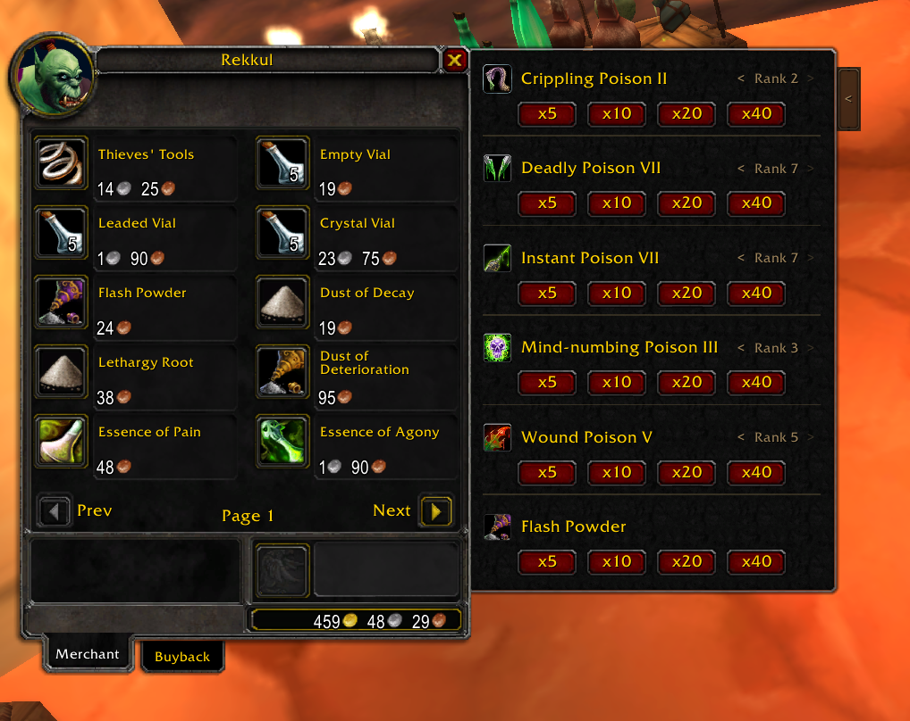

# PoisonVendor

Bulk-buy poison reagents from any poison supplier in one click. Built for **WoW TBC Classic Anniversary (2.5.5)**.

## What it does

Opens a side panel next to the merchant window when you visit a poison vendor. Pick a batch size, click, done. No more mashing the buy button 40 times.

**Supported poisons:**
- Instant Poison
- Deadly Poison
- Crippling Poison
- Mind-numbing Poison
- Wound Poison
- Anesthetic Poison

Also supports **Flash Powder** bulk buying.

## Features

- **Batch buying** — x5, x10, x20, x40 reagent sets per click
- **Rank selector** — switch between learned ranks with `< Rank N >` arrows
- **Reagent tooltips** — hover any batch button to see exact reagent costs before buying
- **Flash Powder** — included as a supply item at the bottom of the panel
- **Collapsible** — small tab on the side to hide/show the panel
- **Native look** — styled to match the default vendor window

## Install

1. Download or clone this repo
2. Copy the `PoisonVendor/` folder into `World of Warcraft/_anniversary_/Interface/AddOns/`
3. Restart the client or `/reload`

The addon only activates for Rogue characters at vendors that sell poison reagents.

## Author

**ViktorSveins**

## License

See [LICENSE](LICENSE).
